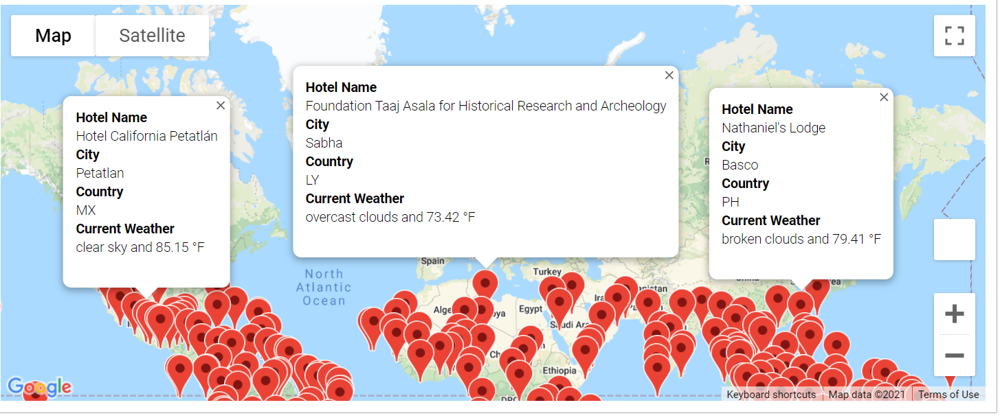
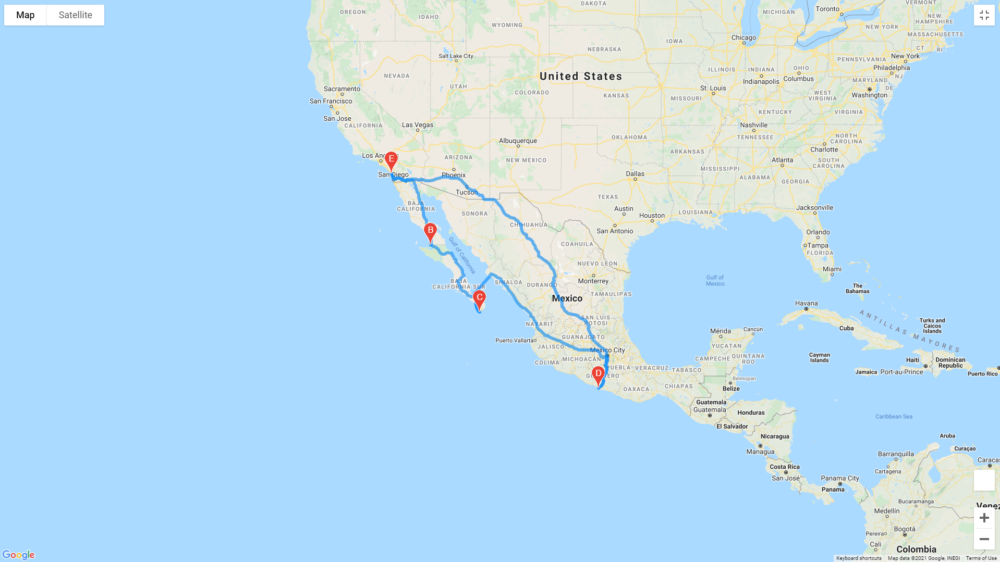
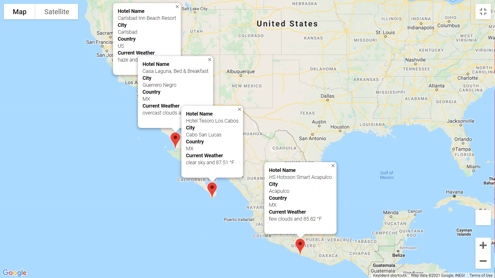

# WeatherPy_Analysis
World Weather Analysis Python 

## Overview of the Project
The purpose of this analysis is to collect weather data from over 500 cities around the world.  Analyze the data using Pandas and plot the data using Matplotlib library and Google maps API. Perform Statistical analyses with SciPy library.  The end result will be a series of plots that visually and statistically show the relationship between latitude and a variety of weather parameters. 

### Purpose:
Retrieve Weather Data 
- Generate a set of 2,000 random latitudes and longitudes
- Retrieve the nearest city
- Perform an API call with the OpenWeatherMap to gather city weather data

- Using API retrieve the current weather description for each city 
- Create a new DataFrame containing the updated weather data
	
Create a Customer Travel Destinations Map 
- Use input statements to retrieve customer weather preferences
- Using those preferences, identify potential travel destinations and nearby hotels 
- Display those destinations on a marker layer map with pop-up markers
	

Create a Travel Itinerary Map 
- Using the Google Directions API to create a travel itinerary that shows the route between four cities chosen from the customer’s possible travel destinations
- Create a marker layer map with a pop-up marker for each city on the itinerary

 ## Resources
 APIs:
 https://openweathermap.org

 https://developers.google.com

 Software: Pythn 3.6.1, Pandas, Matplotlib 3.3.4, Jupyter notebook, Anaconda. Anaconda "PythonData" development environment was created for this project.

 ## Results:

### Retrieve weather data:

For this analyses, Python code [Weather_Database.ipynb](Weather_Database/Weather_Database.ipynb) was created to generate a set of 2,000 random latitudes and longitudes, retrieve the nearest city, and perform an API call with the OpenWeatherMap.

Output save in [WeatherPy_Database.csv](Weather_Database/WeatherPy_Database.csv)  in CSV format

### Create Customer Travel Destination Map:

For this Python analysis,[Vacation_Search.ipynb](Vacation_Search/Vacation_Search.ipynb) used input statements to retrieve customer weather preferences, then use those preferences to identify potential travel destinations and nearby hotels. Then, show those destinations on a marker layer map with pop-up markers.

DataFrame saved in [WeatherPy_vacation.csv](Vacation_Search/WeatherPy_vacation.csv)

A marker layer map with pop-up markers for the cities:

### Create a Travel Itinerary Map:

For this Python analysis,[Vacation_Itinerary.ipynb](Vacation_Itinerary/Vacation_Itinerary.ipynb) used the Google Directions API to create a travel itinerary that shows the route between four cities chosen from the customer’s possible travel destinations. Then, created a marker layer map with a pop-up marker for each city on the itinerary.

The directions layer map:

The marker layer map with a pop-up marker for each city:

